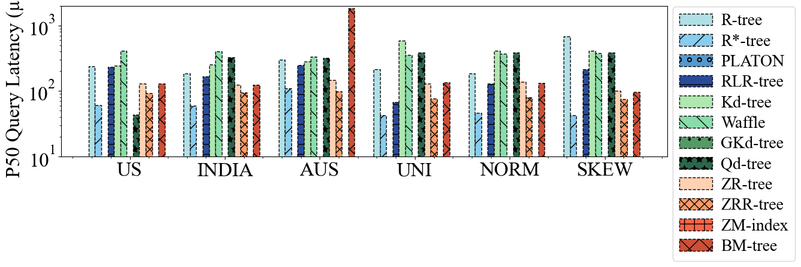
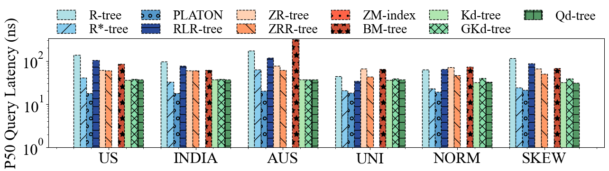
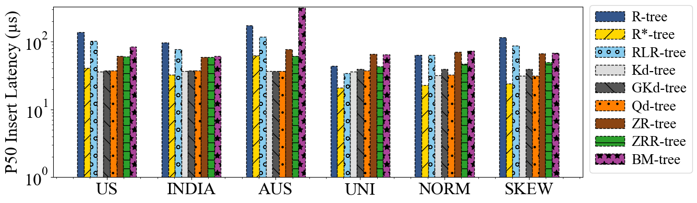

# Benchmarking RL-enhacned Spatial Indices

## Table of Contents
- [Setup](#setup)
  - [1. Libraries](#1-libraries)
  - [2. Datasets](#2-datasets)
    - [Real Datasets](#real-datasets)
    - [Synthetic Datasets](#synthetic-datasets)
  - [3. Configuration](#3-configuration)
    - [Configs](#configs)
  - [4. Prerequisites Before Running Experiments](#4-prerequisites-before-running-experiments)
- [Experiments](#experiments)
  - [Index Tuning](#index-tuning)
  - [Index Building](#index-building)
  - [Read-only Workloads](#read-only-workloads)
    - [Point Query](#point-query)
    - [Range Query](#range-query)
    - [Range Query Varying range](#range-query-varying-range)
    - [Range Query Varying Aspect Ratio](#range-query-varying-aspect-ratio)
    - [Knn Query](#knn-query)
    - [Knn Query (Varying k)](#knn-query-varying-k)
  - [Varying Cardinality](#varying-cardinality)
  - [Write-only Workload](#write-only-workload)
  - [Write-heavy Workload](#write-heavy-workload)
  - [Read-heavy Workload](#read-heavy-workload)
  - [HDD vs. SSD](#hdd-vs-ssd)
  - [Overall](#overall)


---

## Setup


### 1. Libraries

To run the experiments, you need to have LibTorch installed. Download it from the following link:

- [LibTorch v2.4.0 (CPU version)](https://download.pytorch.org/libtorch/cpu/libtorch-cxx11-abi-shared-with-deps-2.4.0%2Bcpu.zip)

### 2. Datasets

The datasets and Workloads required for the experiments can be downloaded from the following Dropbox link:

- [Download Datasets and Workloads](https://drive.google.com/drive/folders/15fTAbMIuJSNF1o3t36NODuaahtt3O7IV)

(Synthetic datasets and all the queries can be generated, thus, these folders are empty.)

After downloading, follow these steps:

1. Create a `data` folder in the root directory of your project (`./`).
2. Move all downloaded files to `./data/`.


#### Real Datasets

- 

- 
- 

#### Synthetic Datasets

- 

- 
- 

### 3. Configuration
#### Configs

Ensure that the experiment configurations are correctly set up by checking the `\exp_config` folder. Adjust the configurations as necessary for your experiments. For example:

```json
{
  "experiments": [
    {
      "available": true,
      "data": {
        "size": 100000000,
        "dimensions": 2,
        "distribution": "us",
        "skewness": 1,
        "bounds": [
          [0, 1],
          [0, 1]
        ]
      },
      "workloads": [
        "point_query_only.json", 
        "range_query_only.json", 
        "knn_query_only.json"
       ],
      "baseline": [
        {
          "name": "rankspace",
          "available": false,
          "config": {
            "fill_factor": 1.0,
            "page_size": 100,
            "bit_num": 32
          }
        },
        {
          "name": "kdgreedy",
          "available": true,
          "config": {
            "page_size": 100
          }
        }
      ]
    }
  ]
}
```
**Explanation**:

- **experiments**: An array containing experiment configurations.
  - **available**: A boolean indicating whether the experiment is available to run.
  - **data**: Describes the dataset used in the experiment.
    - **size**: The number of data points in the dataset.
    - **dimensions**: The number of dimensions (features) in the dataset.
    - **distribution**: The distribution type of the dataset (e.g., "us" for U.S. region-based distribution).
    - **skewness**: The skewness level of the data distribution, with `1` indicating a specific skewness degree.
    - **bounds**: The range of values for each dimension in the dataset, given as an array of min-max pairs.
  - **workloads**: A list of workload files specifying the types of queries to be executed (e.g., point, range, k-NN queries).
  - **baseline**: An array of baseline methods used for comparison in the experiment.
    - **name**: The name of the baseline method.
    - **available**: A boolean indicating whether the baseline method is available for the experiment.
    - **config**: Configuration parameters specific to the baseline method.
      - **fill_factor**: (For rankspace) The fill factor of the index structure.
      - **page_size**: The size of each page (node) in the index.
      - **bit_num**: (For rankspace) The number of bits used in the rank space method.


### 4. Prerequisites Before Running Experiments

1. **Configure .env**
  ```bash
    HDD_PATH="xxx"
    SSD_PATH="xxx"
    TORCH_LIB_PATH=xxx/libtorch/lib
  ```

2. **Install Extended Libspatialindex**:
   - Follow the instructions in the INSTALL.md in **libspatialindex** to install the extended version of `libspatialindex`.

3. **Verify Installation**:
   - Run `check_env.sh` to verify that `libspatialindex` is correctly installed.

4. **Configure Experiments**:
   <!-- - In `run_exp_from_config.py`, set `RUN_EXAMPLE=True` if you want to run the example configurations. -->
   - To run experiments:
     - Use `point_range_knn_queries` for all query-only workloads.
     - Use `write_only, read_heavy_only, write_heavy_only` for insertion-related workloads.

   - Uncomment the code in `run_all.sh` to run.

    ```bash
  ####################### Traditional Start ######################################
  python run_exp_from_config.py exp_config/point_range_knn_queries/config_traditional.json
  python run_exp_from_config.py exp_config/point_range_knn_queries/config_traditional_vary_range.json

  python run_exp_from_config.py exp_config/write_only/config_traditional.json
  python run_exp_from_config.py exp_config/write_heavy_only/config_traditional.json
  python run_exp_from_config.py exp_config/read_heavy_only/config_traditional.json
  ####################### Traditional End ######################################

    ```

5. **Run Experiments**:

To run all the experiments, simply execute the following command in your terminal:

```bash
bash run_all.sh
```

6. **Plot Figures**:
  
  Use notebooks under `./notebook`

## Experiments


### Index building


### Index Tuning

Use range query latency to choose the optimal configuration.


Use range query I/O to choose the optimal configuration.


### Read-only workloads


#### Point query





#### Range query


#### Range query (varying range)


#### Range query (varying aspect ratio)


#### Knn query


#### Knn query (varying k)


#### Varying Cardinality

Point query


Range query


KNN query


### Write-only workload


### Write-heavy workload


### Read-heavy workload






<!--  -->


### HDD vs. SSD


### Overall


### Improvement


